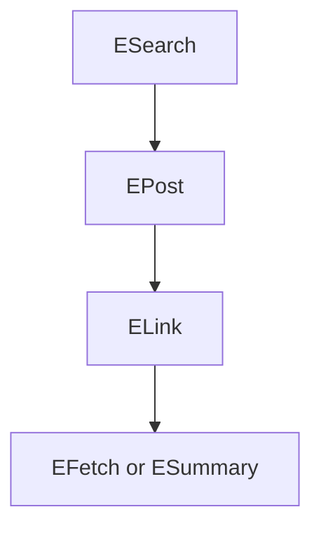

# Entrez Programming Utilities (E-utilities) Developer Guide

This guide summarizes the key technical details from the official [NCBI Entrez Programming Utilities Help](https://www.ncbi.nlm.nih.gov/books/NBK25501/) for developers working with PubMed and other Entrez databases.

---

## 📌 Base URL

All utilities use the same base URL:
```
https://eutils.ncbi.nlm.nih.gov/entrez/eutils/
```

---

## 🔧 Core Utilities

### 1. **ESearch**
- **Purpose:** Perform text-based searches.
- **Example:** Retrieve PMIDs for breast cancer articles:
```url
esearch.fcgi?db=pubmed&term=breast+cancer[mesh]&usehistory=y
```
- **Returns:** List of UIDs, QueryKey, and WebEnv (if `usehistory=y`)

### 2. **EFetch**
- **Purpose:** Retrieve full records in formats like XML, Medline, or FASTA.
- **Example:**
```url
efetch.fcgi?db=pubmed&id=12345678&retmode=xml
```

### 3. **ESummary**
- **Purpose:** Return document summaries (DocSums) for a list of UIDs.
- **Supports:** `version=2.0` for extended metadata fields.

### 4. **EPost**
- **Purpose:** Upload UIDs to the Entrez History Server for batch processing.

### 5. **ELink**
- **Purpose:** Find related or linked records between databases.

### 6. **EInfo**
- **Purpose:** Retrieve metadata about a database (fields, links, counts).

### 7. **EGQuery**
- **Purpose:** Search all Entrez databases simultaneously.

### 8. **ESpell**
- **Purpose:** Get spelling suggestions for a query.

### 9. **ECitMatch**
- **Purpose:** Convert batch citation data into PMIDs.

---

## 📥 Common Parameters

- `db` – Entrez database (e.g., `pubmed`, `protein`)
- `term` – Search query string
- `id` – Comma-separated list of UIDs
- `retmode` – Output format: `xml`, `json`, `text`
- `rettype` – Data type: `abstract`, `medline`, etc.
- `usehistory=y` – Enables history server tracking

---

## 🔐 API Keys and Rate Limits

- **Without API key:** 3 requests/second
- **With API key:** 10 requests/second
- Add with: `&api_key=YOUR_API_KEY`
- Get your API key from: [NCBI Account](https://www.ncbi.nlm.nih.gov/account/)

---

## 🧠 Query Syntax

- Boolean operators: `AND`, `OR`, `NOT`
- Field-specific queries: `term[field]` e.g., `asthma[mesh]`
- Combine query keys: `%232+AND+query` (URL-encoded `#`)

---

## 📘 Using the History Server

- Upload: `EPost` or `ESearch` with `usehistory=y`
- Outputs: `WebEnv`, `QueryKey`
- Use in follow-up calls to avoid resending ID lists

---

## 🔗 Linking Example

```url
elink.fcgi?dbfrom=pubmed&db=protein&id=12345678
```
Finds linked protein records from a PubMed article.

---

## 🧪 Sample Workflow



---

## 🧾 Data Fields in EFetch XML

Common fields from `efetch.fcgi?db=pubmed&retmode=xml`:
- `<MeshHeadingList>` – MeSH Terms
- `<PublicationTypeList>` – Article types
- `<AuthorList>` – Author names
- `<Journal>` – Journal name, issue, volume
- `<Abstract>` – Abstract text

---

## 🛠 Tools & Examples

- Use `curl`, `wget`, `Python requests`, or `Perl LWP` to interact with the API.
- EDirect CLI for UNIX:
```bash
esearch -db pubmed -query "asthma" | efetch -format abstract
```

---

## 🧾 Notes

- Use `+` for spaces, `%22` for quotes, `%23` for `#` in URLs.
- Respect rate limits or risk IP bans.

---

For full details and edge cases, consult the [NCBI Book](https://www.ncbi.nlm.nih.gov/books/NBK25501/).

